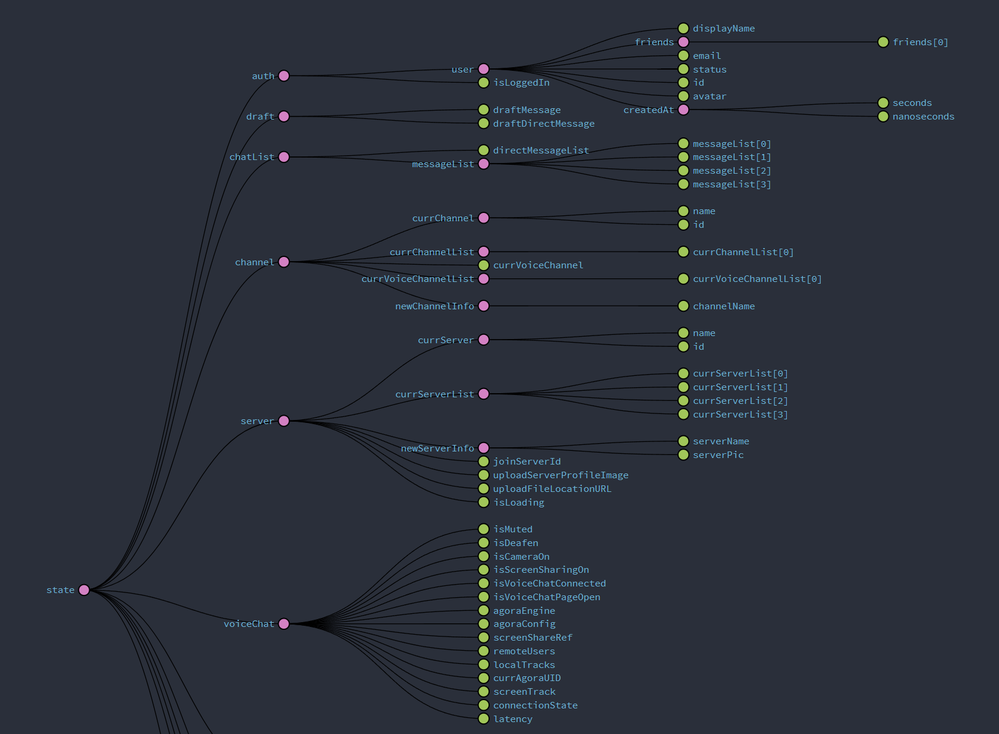
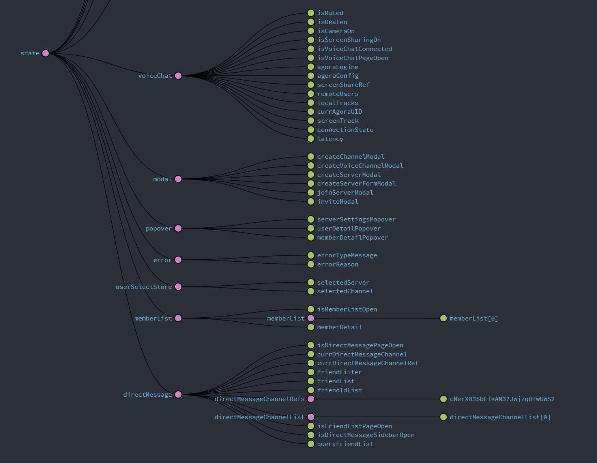
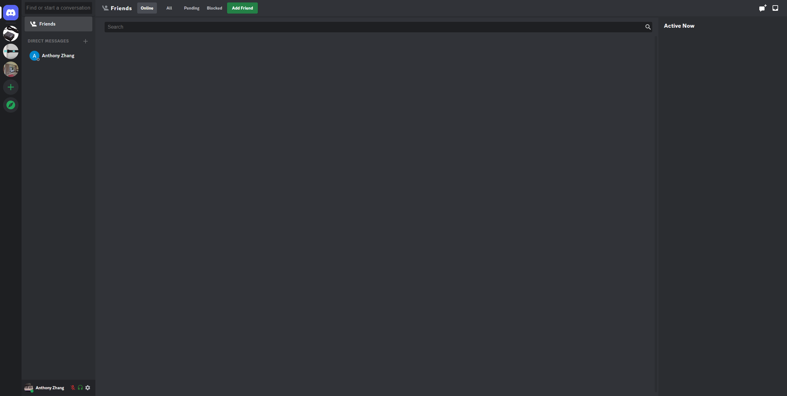
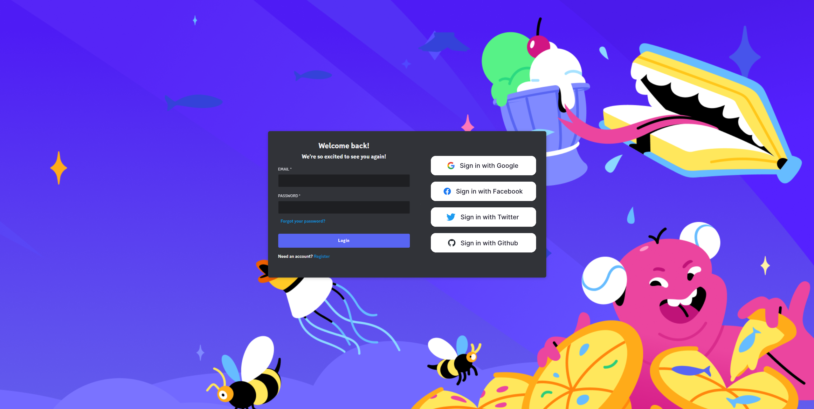

<h1 align="center"> Discord Clone</h1>  
<!-- START doctoc generated TOC please keep comment here to allow auto update -->
<!-- DON'T EDIT THIS SECTION, INSTEAD RE-RUN doctoc TO UPDATE -->

## Table of Contents
- [Introduction](#introduction)
- [Desciption](#description)
- [Why?](#why)
- [Feedback](#feedback)
- [Build Process](#build-process)

<!-- END doctoc generated TOC please keep comment here to allow auto update -->
## Description
This is a Discord Clone! A discord clone that provides real-time voice/video group chat and group messaging.

## Why?
I have been using Discord since 2017, and I absolutely love it. It was created using Electron and has low-latency voice chat with a unique UI design which makes online meetings easy and fun. I don't know if it is possible to recreate the whole thing with myself alone, so I decided to give it a try. My goal is the put my skills to the test, and it turns out that I can. I rebuilt the whole app with React.js as my front-end framework, Redux as my state management system, and used Firebase and Agora for database and real-time voice/video chat.
### Complex State Management with Redux

  

  

### Real-time communication/chat
### Server/Channel

  

  

## Feedback

Feel free to send me feedback on [Any of my Social Media Account](https://github.com/AnthonyZhang220) or [file an issue](https://github.com/AnthonyZhang220/portfolio-website/issues/new). All contributors are always welcome.

If there's anything you'd like to chat about, please feel free to join my discord [Server](https://discord.gg/xkPRmn2HRb)!

## Quick Start and Build Process

- Clone or download the repo
- `npm install` to install dependencies
- create a `.env` file for firebase and agora SDK for environment variables
- `npm start` to start the packager and run the app on localhost:3000
